# Ment-Care
---
## To Run The Project on linux

#### install a python virtual environement

```
python -m venv venv
```

#### Activate that environement

```
source venv/bin/activate
```

#### Install all the the required packages
```
pip install -r requirements.txt
```
#### Navigate to the folder that contains manage.py file
```
python manage.py runserver
```
#### On Your Browser, Navigate to 127.0.0.1:8000


# FINAL REPORT
---
### Users:

#### Patient

- [x] Chat with Doctor:

  - This feature allows a patient to chat with their doctor once logged in.
  - Log in from main page.
  - On the dashboard at the top of the page, click the button labeled 'chat with doctor'
    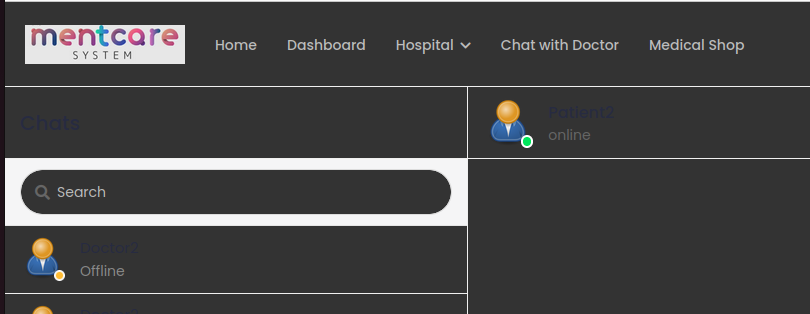

- [x] Booking an Appointment:

  - This feature allows a patient to request an appointment date, appointment time, appointment type, as well as a special message.
  - After logging in, go to the patient dashboard, click the Search Doctor button.
  - Once you view the patient’s available doctors, click Book Appointment
  - Fill out the appointment information, and submit the request.
    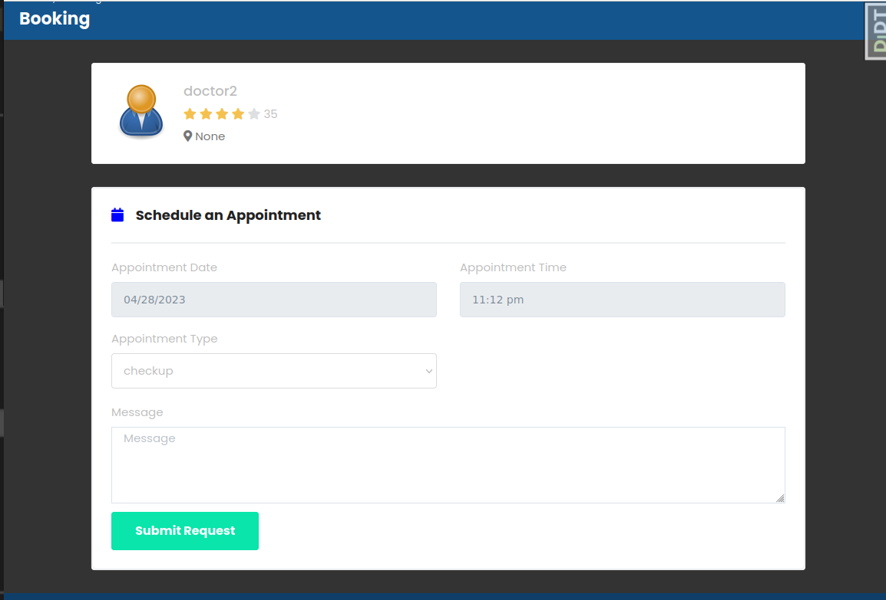

- [x] Prescriptions | Dashboard:
  - The prescription tab on the dashboard allows you to view all of your prescriptions, and see information such as: The prescription ID, the doctor name and link to profile , and a button to view the prescription report. When you view the prescription as a pdf, you will see more indepth information such as the patient and the doctors contact information, the date of the prescription, the name of the medicine, how much they were prescribed, the frequency of taking the medicine, how long you have to take the medicine, whether you have to take the medicine with a meal or note, and other instructions that the doctor feels is necessary.
    After you click on Prescription, you can click view on one of the prescriptions.
    Now you will see an HTML rendering of the information the prescription pdf gives you.
    You may also click the Download Prescription button to view it as a pdf.
    Medical Records | Dashboard'

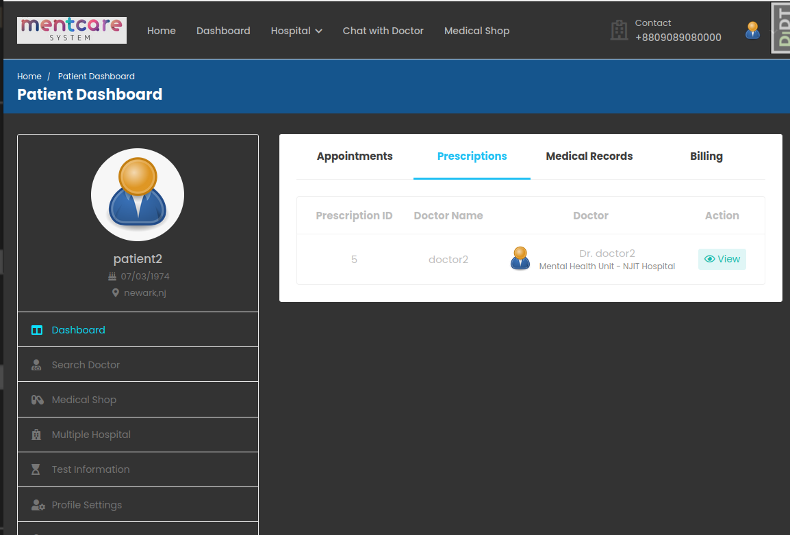

- [x] The medical records tab allows patients to see a summarized view of their patient record. In the summarized view the patient will be able to see all information about them, as well as see their history and diagnoses.After you click on the medical record, you can click to view it. You will see an HTML rendering of the information the patient record pdf gives you. You may also click the Download Report button to view it as a pdf.
      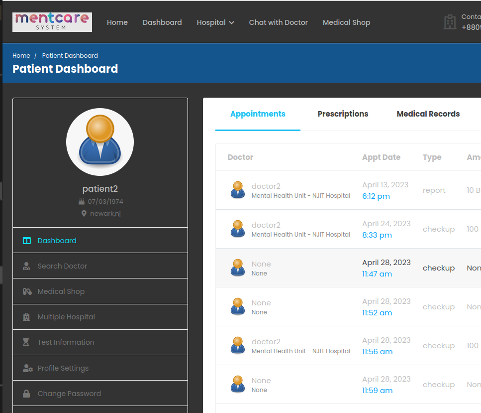

#### Doctor

- [x] Patient Appointments | Dashboard

  - The patient appointments section shows the doctor how many appointments they lined up, and include information such as: the patient name, the appointment date, the purpose of the visit, the contact information of the patient, and the status of the appointment. The dashboard also shows how many appointments they have the next day, how many patients they have to see the current day, and their total amount of future appointments scheduled.
    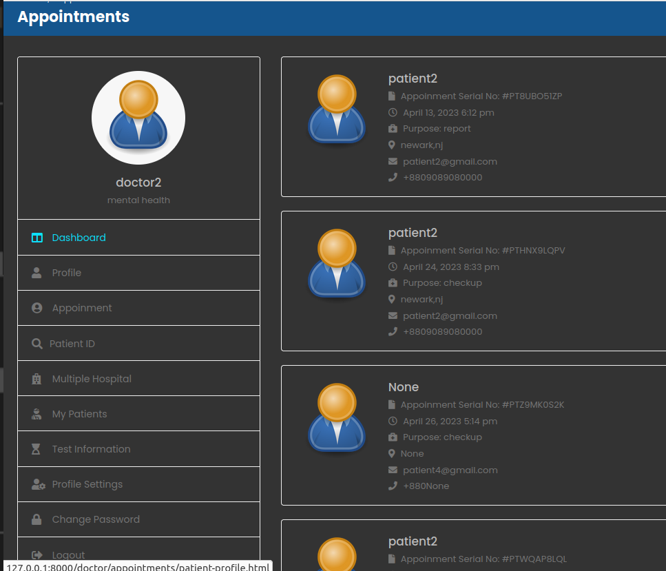

- [x] Appointment | Dashboard
  - With this feature, you can view all of the patients that the doctor has had an appointment for. It is filled with information about the appointment and patient such as the patients name, the serial number of their appointment, the date and time, the purpose of visit, the location of office, the patients email, the payment status, and their phone number.
  - After logging in as a doctor, click on the Doctor Dashboard button.
  - You can find appointment tab on the left side.
  - You have options of what you can interact with now:
  - Click on the patient to go directly to the patient profile
  - Click on View button to see a pop up summary of the appointment
  - You can either accept or reject the appointment
    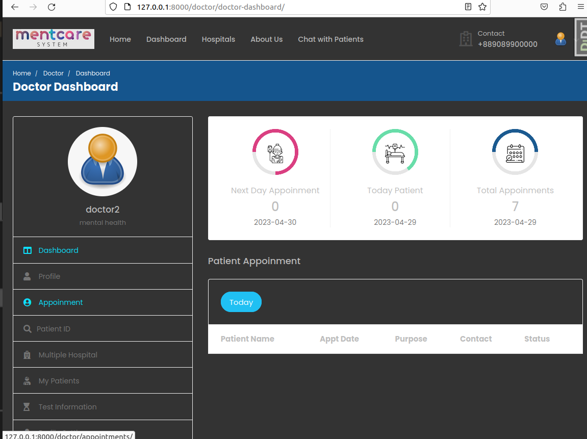
- [X} Patient ID | Dashboard

  - This feature allows you to input the patient id number, and be taken directly to their profile.

  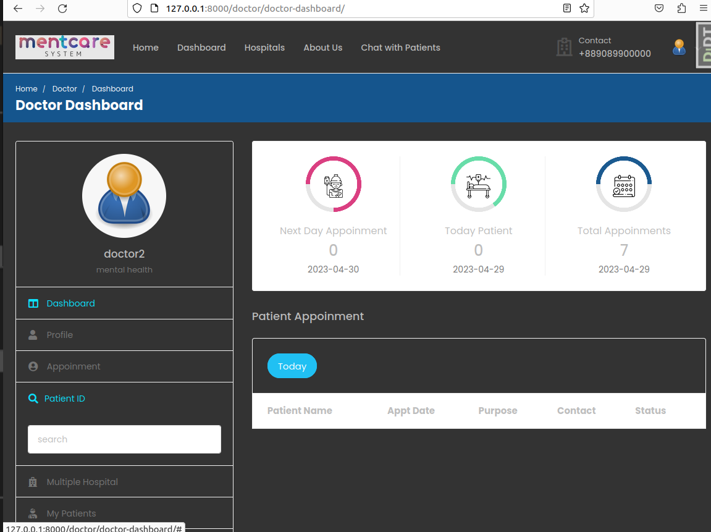

- [x] My Patients | Dashboard
  - This feature on the dashboard allows the doctor to view all of their patients profiles, as well as some summarized information on them such as: their patient id, their address, their phone number, their age, and their blood type.

#### Admin

- [x] Dashboard - Can view information such as total doctors, total patients, total hospitals, and total lab workers.
      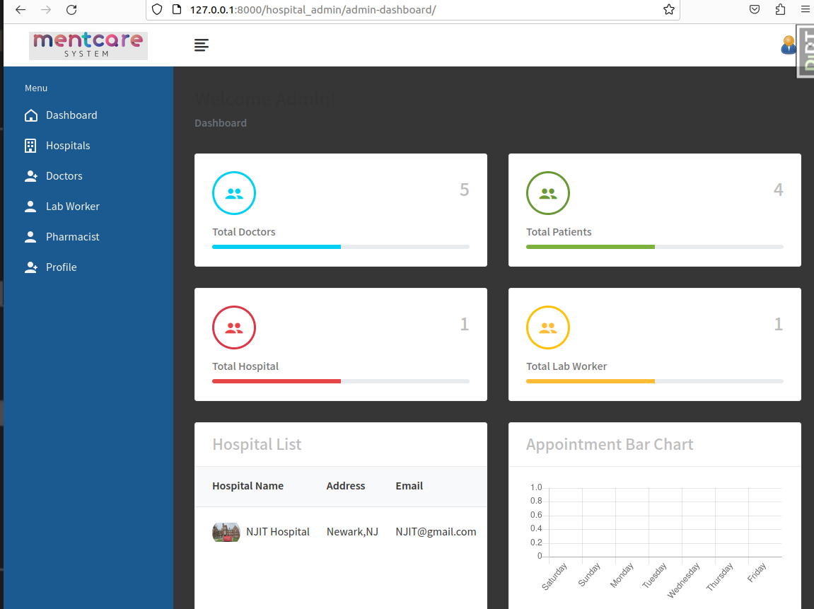

- [x] Hospitals | Dashboard
      Can add and edit information for the hospital, as well as emergency information.

- [x] Doctors | Dashboard
  - Can view a list of doctors registered, as well as a list of doctors pending approval of their registration.

#### Clinical Staff

- [x] Dashboard

  - Can view a list of patients, the list of tests, a list of tasks, a search bar for patients through their id, and patient records.
    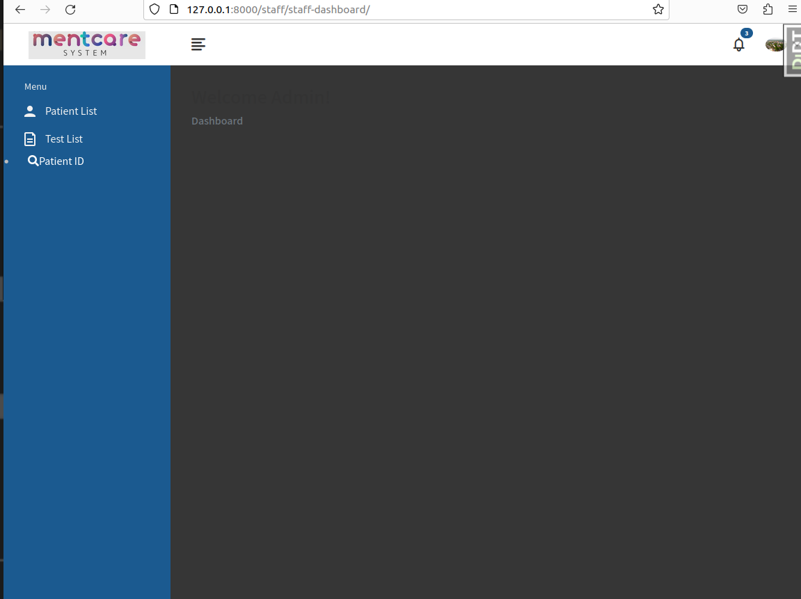

- [x] Patient List | Dashboard

  - Can view reports of patients and their basic information.
    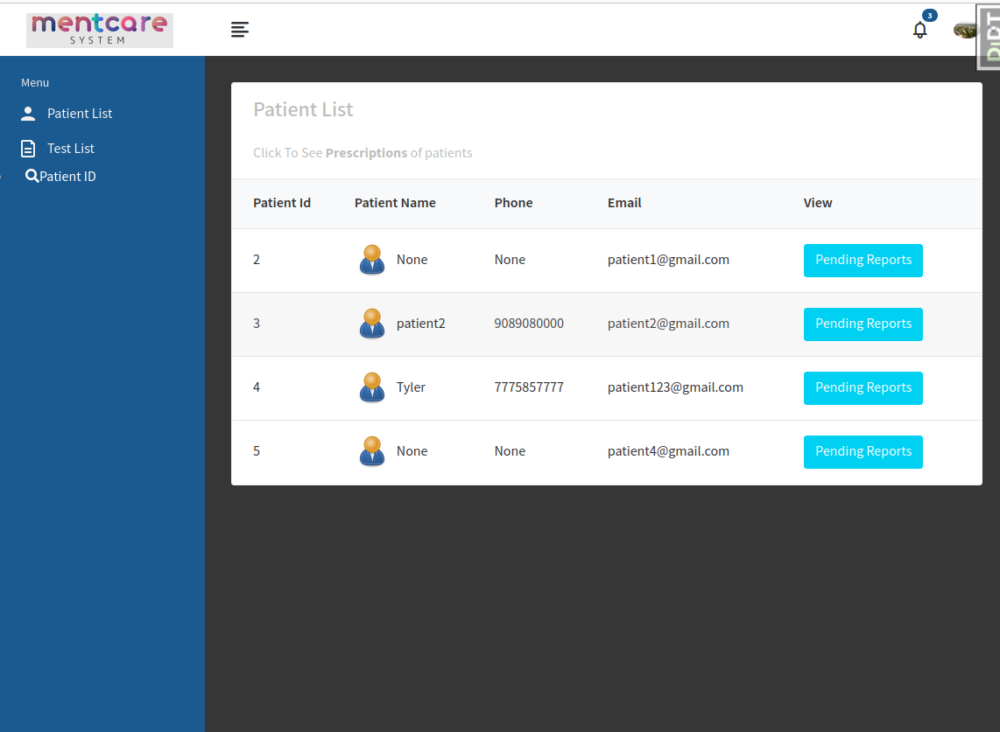

- [x] Patient ID | Dashboard

  - Can search patients by their ID.
    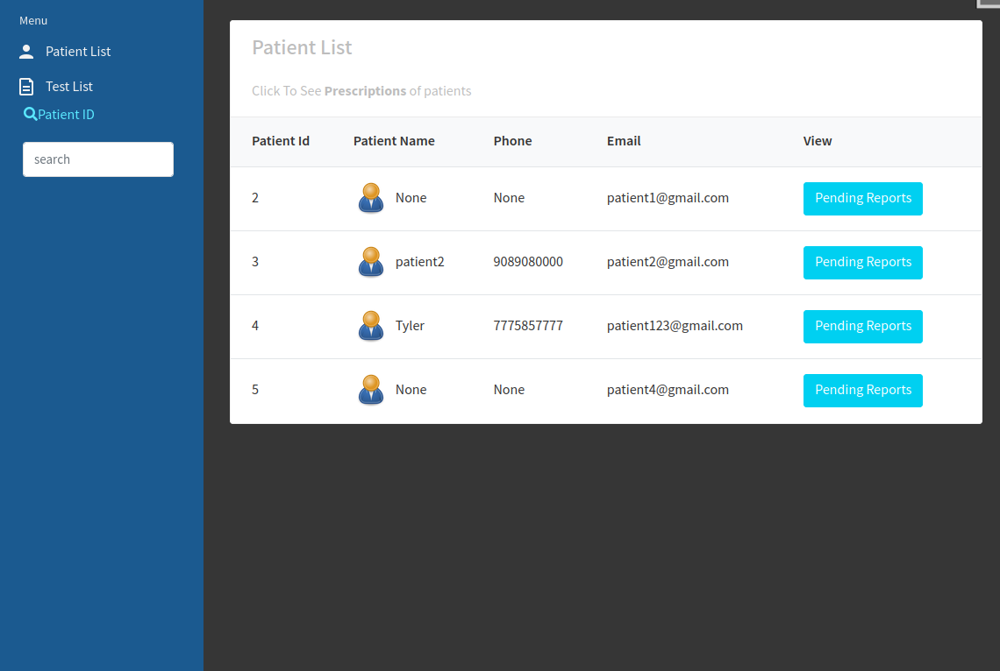

- [x] Records | Dashboard
  - Can view patient records
    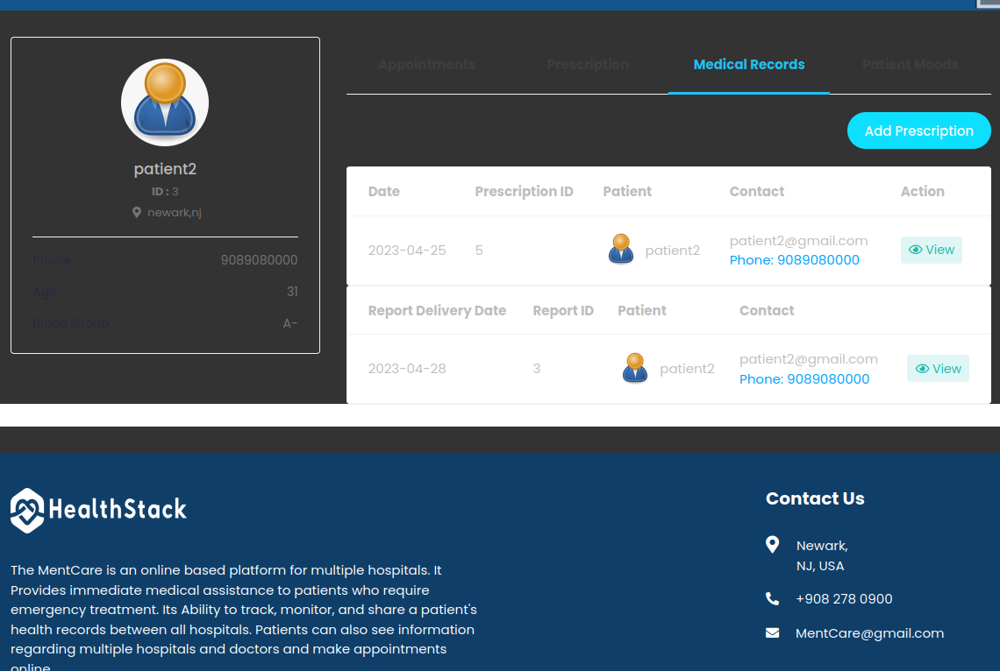

---

## TECHNICAL OVERVIEW

### Satisfactory:

- [x] Technical Overview contains a description of any substantive changes to the existing codebase, and of the architecture of your new code.
- [x] It uses UML diagrams, CRC cards, state diagrams or any of the other techniques that help describe the structure.
- [x] It provides a well-reasoned rationale for why this is the “right” design.
- [x] The document is at most 2 pages (fewer pages are absolutely acceptable, consider this a rough limit)

#### Our project was heavily inspired by  team

- Their original implementation had only two users in mind, both the doctors patients. Their application also had no interest on who it is that was using their
  system as it only targeted boh patients and doctor. In their design, only patients can make appointments for themselves and only the doctors are capable of approving or
  rejecting the appointment request. So their system was based on a one-to-one system where patients and doctors are fully in control of the system.
- Our design uses a different structure where both doctors & patients do not need to communicate with one another through a server. Everything is done through a middleman, in this case which is
  the Health Staff. Here is an example below.
  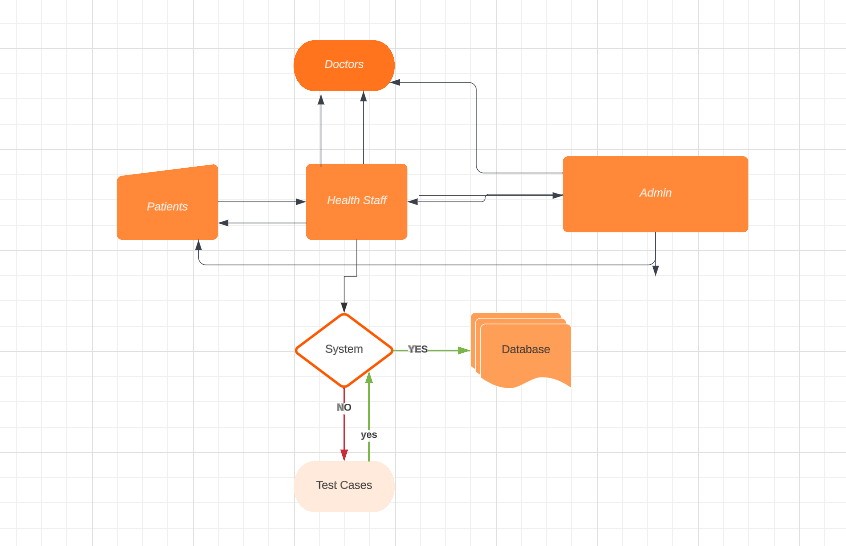

#### As we can see above, the design works well as there is a 'checks and balances'

##### Adminstrators:

- They are able to view the entire system
  - They are able to see of the appointments charts and which doctors are in the system. They are the super user if you like
- They are also able to enter hospital workers such as doctors and staff
- They also have the power to delete such worker
- In other words, their hands can reach every where.

##### Patients:

- Patients can request an appointment
- They are also able to view their records
- Everytime they login, they are faced with an opportunity to express how they feel.

##### Doctors:

- They are able to see who has an appointment for that day.
- However, they do not decide whether to accept or reject an appointment.
- They are capable of seeing the mood records of their patients.

##### Health Staff:

- They are what we consider the middleman of our system. Any possible forms between the patient and the doctor goes through them.
  - They accept appointments
  - Create appointments
  - Create reports
  - accept meeting notes from doctor

#### Our Design was better

- Although the codebases that we orked on had some pretty good implementations, i believe that our changes would definitely make their implementations
  better. However, that is also an unfair assessment. Their system meant to serve as system between simply a doctor from a hospital and a patient. The domain of that field was nonexistent. This design process would only make it harder for the doctor as he must be able to do everything by himself. From checking his patients onto being up-to-date with system, that would be pretty daunting. Our system meant to simplify that process by giving the doctor less work and have him access to data on patients such as their moods, social media toxicity.

---

## PROCESS OVERVIEW

### Satisfactory

- [x] Process overview contains a detailed description of the manner in which agile project management processes were used during the project (i.e., sprints, sprint reviews, retrospectives and blameless reviews).
- [x] It provides a summary of what was planned to happen in each sprint vs what actually happened, with a discussion of what was revised as a result.
- [x] The document is at most 2 pages (fewer pages are absolutely acceptable, consider this a rough limit)

#### Agile Methodology

- [ ] Sprints
  - Some of our sprint included
    - [x] Appointment Diary System
      - They purpose of this sprint was to be able to somehow be able to send confirmation messages to the patient after their patient has submitted an appointment
      - Most of the functionalities were finished except that part.
    - [x] Patient Mood analysis
      - This task required us that we ask the patient for input on how their daqy was and be able to continously track their progress as days went.
      - This task was complete and we even had a couple more days than we needed.
      - We proceeded to use that time by using a model to be able to classify the patients input to either negative or positive.
    - [x] Record System
      - This task required us to create patient record system that stored mental health information. The user can also print the results as a pdf.
      - This task was being worked on until the end of the project. This required all users dashboards to be finished to be linked up to them.
      - Not everything had to be made from scratch because there was code already in the project we were basing it off of.
    - [x] UI Overhaul
      - This task was to make the website more presentable, adding colors that were easier on the eyes, and replacing images the reflected our assignment.
      - This tasks plan was to put a dark mode to be more modern
    - [x] Implement a forms-based Individual care management system
      - The goal is to implement a records management system that can create records for patients
      - Edit the information in the system
      - View patient history, etc.
      - It will also support data summaries for doctors who meet brand new patients, so they can quickly get a brief summary of their medical history.
      - This task is the bulk of the project and requires almost all features to be completely finished, so this task is left till the end.
    - [x] Prescription System
      - This feature was already builtin in the base project.
      - We did have to change some of the options within to match it more to our projects requirements
        - We needed mental health drugs
  - So in one sprint, we didnt have anough time to completely be able to finish with our plan, but in the second we had enough time so we added more to be able to enhance it.
- [ ] Sprint reviews
  - We continously strived to make Sprint reviews after each sprint.
  - In some cases, we weren't able to finish some tasks by the end of the sprint, so we left it behind to implement other things.
  - Some tasks, such as the RASA chatbot, required too much work and knowledge of the codebase to complete in the allotted time.
- [ ] Continous development
  - We were continously making changes to our github branch.
  - For every feature we make, we create a seperate branch, and test it to make sure it will work before making a pull request.
- [ ] Strong on collaboration
  - We collaborated instensively throughout the course of the project.       


BIG THANKS TO @Jawwad-Fida    
My team and I only added things onto it that we thought would improve the system.      
This is a link to the original project:      
https://github.com/Jawwad-Fida/HealthStack-System      


