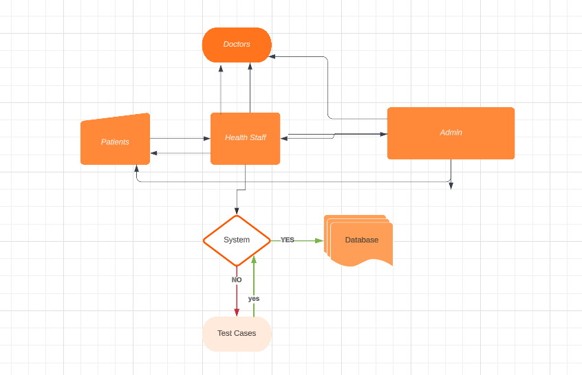

# FINAL REPORT
---
## PRODUCT FEATURES OVERVIEW

### Satisfactory:
- [X] The Feature section contains sufficient documentation for a user to interact with your updated version of PRODUCT.
- [X] documentation covers all steps that the user would need to take to exercise all of your user stories.
- [X] Screenshots are included that capture the key interactions between a user and your new product.
- [X] Course staff were able to follow these instructions to successfully interact with your project implementation.
- [X] The section is at most 4 pages (roughly 2,000 words maximum), NOT including figures. Fewer pages are absolutely acceptable, consider this a rough limit

---
## TECHNICAL OVERVIEW
### Satisfactory:

- [X] Technical Overview contains a description of any substantive changes to the existing codebase, and of the architecture of your new code.
- [X] It uses UML diagrams, CRC cards, state diagrams or any of the other techniques that help describe the structure.
- [X] It provides a well-reasoned rationale for why this is the “right” design.
- [X] The document is at most 2 pages (fewer pages are absolutely acceptable, consider this a rough limit)

#### Our project was heavily inspired by  team
- Their original implementation had only two users in mind, both the doctors patients. Their application also had no interest on who it is that was using their
system as it only targeted boh patients and doctor. In their design, only patients can make appointments for themselves and only the doctors are capable of approving or
rejecting the appointment request. So their system was based on a one-to-one system where patients and doctors are fully in control of the system.
- Our design uses a different structure where both doctors & patients do not need to communicate with one another through a server. Everything is done through a middleman, in this case which is
the Health Staff. Here is an example below.

#### As we can see above, the design works well as there is a 'checks and balances'
##### Adminstrators:
- They are able to view the entire system
  - They are able to see of the appointments charts and which doctors are in the system. They are the super user if you like
- They are also able to enter hospital workers such as doctors and staff
- They also have the power to delete such worker
- In other words, their hands can reach every where.

##### Patients:
 - Patients can request an appointment
 - They are also able to view their records
 - Everytime they login, they are faced with an opportunity to express how they feel.
 
##### Doctors:
- They are able to see who has an appointment for that day.
- However, they do not decide whether to accept or reject an appointment.
- They are capable of seeing the mood records of their patients.

##### Health Staff:
- They are what we consider the middleman of our system. Any possible forms between the patient and the doctor goes through them.
  - They accept appointments
  - Create appointments
  - Create reports
  - accept meeting notes from doctor
 
#### Our Design was better
- Although the codebases that we orked on had some pretty good implementations, i believe that our changes would definitely make their implementations 
better. However, that is also an unfair assessment. Their system meant to serve as system between simply a doctor from a hospital and a patient. The domain of that field was nonexistent. This design process would only make it harder for the doctor as he must be able to do everything by himself. From checking his patients onto being up-to-date with system, that would be pretty daunting. Our system meant to simplify that process by giving the doctor less work and have him access to data on patients such as their moods, social media toxicity.
---
## PROCESS OVERVIEW
### Satisfactory

- [X] Process overview contains a detailed description of the manner in which agile project management processes were used during the project (i.e., sprints, sprint reviews, retrospectives and blameless reviews).
- [X] It provides a summary of what was planned to happen in each sprint vs what actually happened, with a discussion of what was revised as a result.
- [X] The document is at most 2 pages (fewer pages are absolutely acceptable, consider this a rough limit)

#### Agile Methodology
###### We used the agile methodology to the best of what we could.

